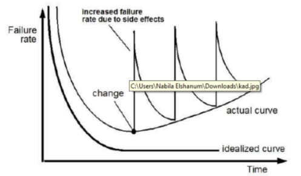

# Tugas \#1 APPL

<dl> 
	<dt style="text-align: center;"> 
	<h4>Tugas   APPL minggu ke-1. Take Home Worksheet  Dikerjakan  perorangan ,  jawaban harus ditulis tangan </h4>
	</dt>
</dl>
| No	| Soal	| Jawaban                                                     	|
|:---:	| ------	|-------------------------------------------------------	|
| 1	| a. Apa yang dimaksud dengan Software  b. Apa itu  Software Engineering menurut IEEE | a. Menurut Roger S. Pressman (2002), pengertian software adalah suatu perintah program dalam sebuah komputer yang apabila dieksekusi oleh usernya akan memberikan fungsi dan unjuk kerja seperti yang diharapkan oleh user-nya.  b. Berdasarkan IEEE: 1. The application of a systematic,disciplined,quantifiable approach to the development,operation and maintenance of software; that is, the application of engineering to software. 2. The study of approaches as in the above statement.	|
| 2	| Cari 1  contoh software yang di-*embed* di suatu mesin/perangkat keras, dan gambarkan bagaimana  cara kerja mesin tersebut	| 	|
| 3	| a. Beri Contoh Software yang  menurut Anda Cerdas. Jelaskan bagaimana kecerdasannya. b. Jika Anda diminta membuat software cerdas tersebut maka pendekatan rekasaya sistem apa yang Anda gunakan. Tuliskan alasannya	|	|
| 4	| Sebutkan  4 prinsip Rekayasa menurut POLYA	|	|
| 5	| Cari 1 contoh aplikasi web terbaik dalam melayani transaksi penjualan, pembelian. Jelaskan alasan pemilihan Anda.	|	|
| 6	| Tuliskan 3 perbedaan pendekatan Terstruktur dan pendekatan Berorientasi Object yang Anda pahami	|	|
| 7	| Apa yang dimaksud dengan REKAYASA SISTEM? Apa hubungannya dengan REKAYASA PERANGKAT LUNAK?	|	|
| 8	| Kurva berikut merupakan kurva yang menggambarkan failure rate pada software. Jelaskan maksudnya 	| 	|
